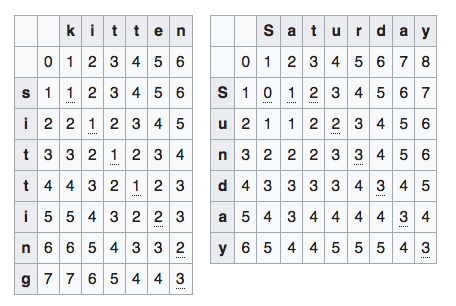

# Levenshtein distance

the Levenshtein distance between two words is the minimum number of
single-character edits (insertions, deletions or substitutions) required
to change one word into the other.

Levenshtein distance may also be referred to as edit distance

```
function LevenshteinDistance(char s[1..m], char t[1..n]):
  // for all i and j, d[i,j] will hold the Levenshtein distance between
  // the first i characters of s and the first j characters of t
  // note that d has (m+1)*(n+1) values
  declare int d[0..m, 0..n]

  set each element in d to zero

  // source prefixes can be transformed into empty string by
  // dropping all characters
  for i from 1 to m:
      d[i, 0] := i

  // target prefixes can be reached from empty source prefix
  // by inserting every character
  for j from 1 to n:
      d[0, j] := j

  for j from 1 to n:
      for i from 1 to m:
          if s[i] = t[j]:
            substitutionCost := 0
          else:
            substitutionCost := 1
          d[i, j] := minimum(d[i-1, j] + 1,                   // deletion
                             d[i, j-1] + 1,                   // insertion
                             d[i-1, j-1] + substitutionCost)  // substitution

  return d[m, n]
  ```


